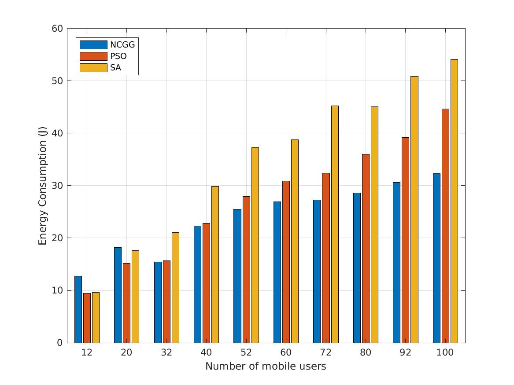
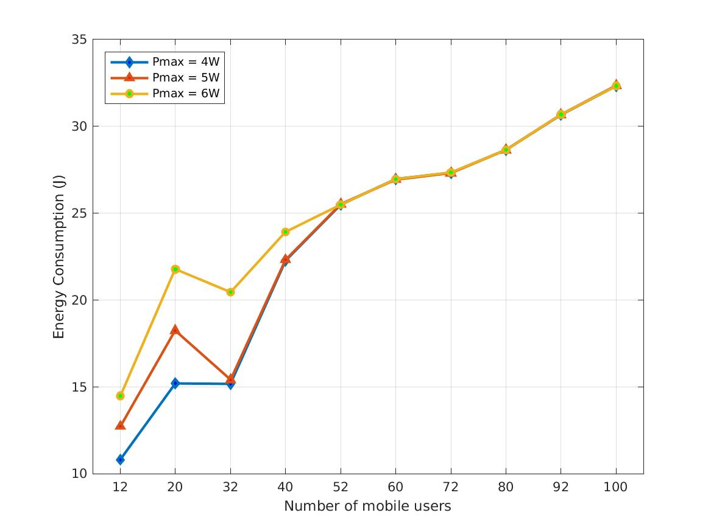
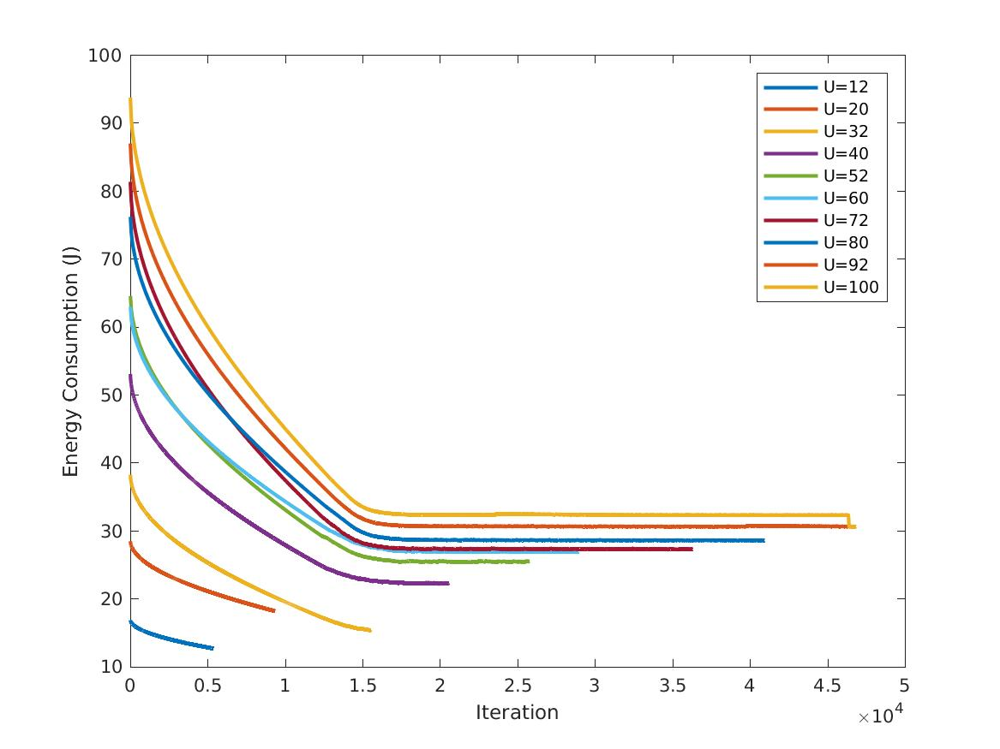
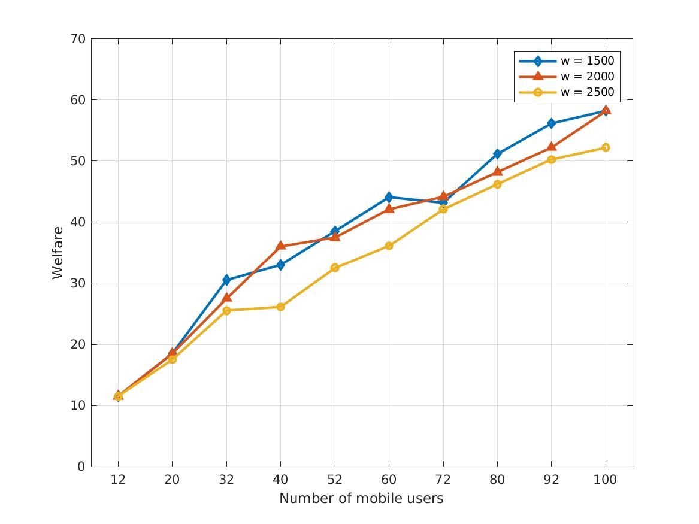
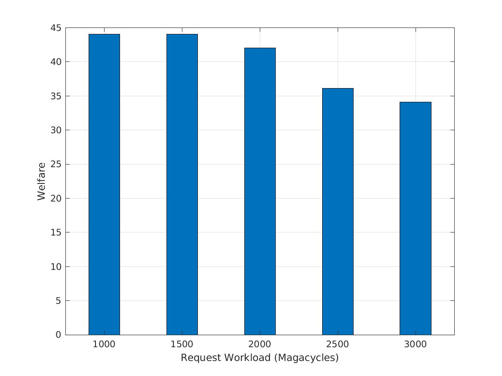
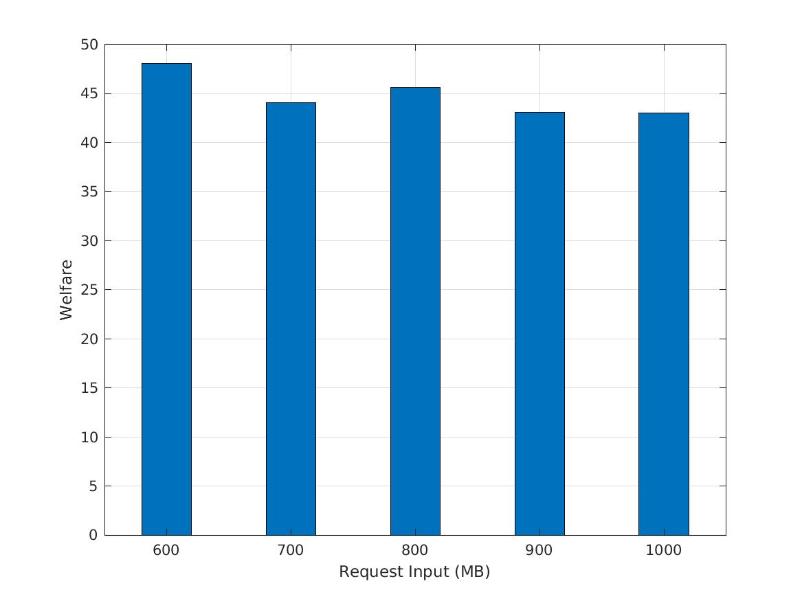

# Dynamic Request Scheduling Optimization in Mobile Edge Computing for IoT Applications

## Problem 1: Power Allocation

PA.m (PA function)

SubGrad.m (Subgradient function)

NCGG.m (Implementation of NCGG algorithm)

SA.m (Implementation of SA algorithm)

PSO.m (Implementation of Inertia Weighted Particle Swarm Optimisation algorithm)

### Results

1. Energy consumption vs Number of Mobile Users (pmax = 5W).

2. Energy consumption vs Maximum Power (pmax).

3. Convergence Property of NCGG vs Number of Mobile Users (pmax = 5W, y axis is E, not Error of E in the paper).

## Problem 2: Joint Request Offloading and Computing Resource Scheduling

JRORS.m (JRORS function)

Welfare_PSO.m (Implementation of Binary Particle Swarm Optimisation)

### Results

1. Performance versus different number of mobile users ($I_q = 700KB$).

2. Performance versus different request workload ($U = 60, I_q = 700 KB$).

3. Performance versus different request input ($U = 60, w_q = 1500$ Magacycles).

